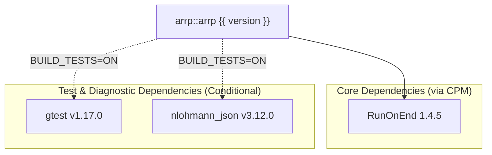

# arrp

<div class="hero-tagline">Thread-safe resource pool library.</div>

[](https://dev.azure.com/siddiqsoft/siddiqsoft/_build/latest?definitionId=33&branchName=main)
[](https://www.nuget.org/packages/SiddiqSoft.arrp/)
[](https://www.nuget.org/packages/SiddiqSoft.arrp/)
[](https://dev.azure.com/siddiqsoft/siddiqsoft/_build/latest?definitionId=33&branchName=main)
[](https://en.cppreference.com/w/cpp/20)
[](LICENSE)

**arrp** (`Auto Returning Resource Pool`) is a lightweight, thread-safe, header-only C++20 resource pool library.

**[Documentation: https://siddiqsoft.github.io/arrp/](https://siddiqsoft.github.io/arrp/)**

## Quick Example

```cpp
#include <siddiqsoft/arrp.hpp>
#include <string>
#include <iostream>

int main() {
    siddiqsoft::arrp::resource_pool<std::string> pool {8};

    pool.seed("connection-1");
    pool.seed("connection-2");

    {
        auto resource = pool.try_borrow();
        if (resource) {
            resource->append(" [active]");
            std::cout << "Using resource: " << *resource << '\n';
        }
    } // resource returns to the pool automatically
    
    return 0;
}
```

## Dependencies



See the [Getting Started guide](https://siddiqsoft.github.io/arrp/quickstart/#dependencies) for full installation instructions.

## License

BSD 3-Clause License. See [LICENSE](LICENSE).
