# Architecture & Diagnostics

`arrp` (Asynchronous Resource Reusable Pool) is designed for modern C++20 workflows requiring deterministic, RAII-enforced pooling of generic resources without triggering `std::bad_alloc` or risking resource exhaustion under heavy load.

## Core Design Tenets

1. **Lock-Aware but Not Lock-Free**: `resource_pool<T>` uses a combination of `std::mutex` (for memory synchronization) and `std::counting_semaphore` (for async/blocking waiters). While not strictly lock-free, this architecture provides extremely high throughput because the critical section only involves `std::vector` `push_back`/`pop_back`.
2. **Move Semantics**: Everything in `arrp` revolves around `<utility>` moves. Objects are moved into the pool memory via `seed(T&&)` and moved out via `try_borrow()`. There are zero allocations occurring on the hot path after the pool is seeded.
3. **Guard-Oriented**: Users never receive a raw `T*`. They receive a `resource_guard<T>`, which behaves like a smart pointer but securely returns the resource back to its parent pool exactly when it falls out of scope, guaranteeing safety even during unwinding from exceptions.

## UML Class Diagram

```mermaid
classDiagram
    direction TB

    classDef coreClass fill:rgba(35,73,109,0.08),stroke:#23496d,stroke-width:2px;
    classDef utilityClass fill:rgba(15,118,110,0.08),stroke:#0f766e,stroke-width:2px;
    classDef exceptionClass fill:rgba(185,28,28,0.06),stroke:#b91c1c,stroke-width:1.5px;
    classDef externalClass fill:rgba(100,116,139,0.06),stroke:#64748b,stroke-width:1.5px,stroke-dasharray: 4 3;
    classDef highlightClass fill:rgba(2,132,199,0.18),stroke:#0284c7,stroke-width:3px;

    class resource_guard["siddiqsoft::arrp::resource_guard"] {
        +resource_guard(const resource_guard &) void
        +operator_assign(const resource_guard &) resource_guard &
        +resource_guard(const pool_error &err) void
        +resource_guard(resource_guard &&src) void
        +operator_assign(resource_guard &&src) resource_guard &
    }
    class resource_guard:::coreClass

    class resource_pool["siddiqsoft::arrp::resource_pool"] {
        +resource_pool(resource_pool &) void
        +resource_pool(resource_pool &&src) void
        +operator_assign(resource_pool &) resource_pool &
        +operator_assign(resource_pool &&src) resource_pool &
        +resource_pool(uint8_t init_capacity, std::function~ void(T &)~ &&on_shutdown_callback) void
    }
    class resource_pool:::coreClass


    link resource_guard "https://github.com/SiddiqSoft/arrp/blob/master/include/siddiqsoft/private/resource_guard.hpp#L99" "Source: include/siddiqsoft/private/resource_guard.hpp"
    link resource_pool "https://github.com/SiddiqSoft/arrp/blob/master/include/siddiqsoft/private/resource_pool.hpp#L77" "Source: include/siddiqsoft/private/resource_pool.hpp"
```

<!-- UML_CLASS_DIAGRAM_START -->

### Source Code Mapping

| Component / Class | Header File | Source Link | Purpose & Architectural Role |
| :--- | :--- | :--- | :--- |
| [`siddiqsoft::arrp::resource_guard`](../api/resource_guard.md) | <code>include/siddiqsoft/private/<wbr>resource_guard.hpp</code> | [`resource_guard.hpp`](https://github.com/SiddiqSoft/arrp/blob/main/include/siddiqsoft/private/resource_guard.hpp#L99) | RAII wrapper for managing resource lifecycle in a resource pool. |
| [`siddiqsoft::arrp::resource_pool`](../api/resource_pool.md) | <code>include/siddiqsoft/private/<wbr>resource_pool.hpp</code> | [`resource_pool.hpp`](https://github.com/SiddiqSoft/arrp/blob/main/include/siddiqsoft/private/resource_pool.hpp#L77) | Thread-safe auto-returning resource pool. |
<!-- UML_CLASS_DIAGRAM_END -->
