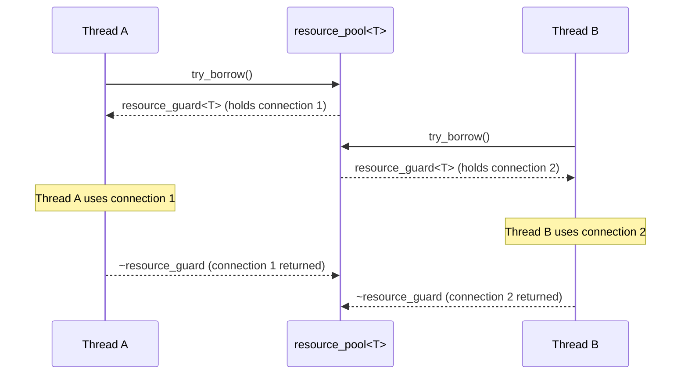

# Threading & Lifetime Guarantees

Understanding thread-safety boundaries and object lifetime requirements is critical for ensuring crash-free, deterministic behavior when using `arrp`.

---

## Thread-Safety Model

| Type / Operation | Thread Safety Level | Details |
|---|---|---|
| `resource_pool<T>` | **Thread-Safe** | All public methods (`try_borrow`, `try_borrow_create`, `seed`, `clear`, `size`, `to_json`) synchronize access to pool internal state via an internal `std::mutex`. |
| `resource_guard<T>` | **Thread-Hostile / Move-Only** | Individual guard objects are **not thread-safe**. A guard instance must belong to a single thread at any given time. Move ownership if passing between threads. |



---

## Lifetime Rule: Pool Must Outlive Guards

> [!CAUTION]
> **Do NOT allow a `resource_guard<T>` to outlive its parent `resource_pool<T>`.**

Each `resource_guard<T>` holds a std::function callback pointing back to its parent pool. If a guard is destroyed after the pool has already been destroyed, invoking the return callback will cause undefined behavior or memory corruption.

### Best Practice: Scope Hierarchies

Always construct the `resource_pool<T>` at a broader scope (e.g., application object level, thread pool owner) than any code borrowing resources:

```cpp
void safe_lifetime_example()
{
    siddiqsoft::arrp::resource_pool<std::string> pool {8};

    {
        auto guard = pool.try_borrow();
        // Use guard inside this inner scope...
    } // Guard is destroyed BEFORE pool goes out of scope -> SAFE!
}
```

---

## Destruction & Shutdown Behavior

When a `resource_pool<T>` is destroyed:

1. An internal flag `m_shutdownInitiated` is set to `true`.
2. Any subsequent calls to `seed()` or `try_borrow()` will immediately return `pool_error::ShutdownInitiated`.
3. All resources currently remaining in the available queue are destroyed. If a shutdown callback was provided at pool construction, it is executed for each available resource.
4. Outstanding guards that are destroyed **after** pool destruction starts will discard their resources gracefully if the pool has already started shutting down.
