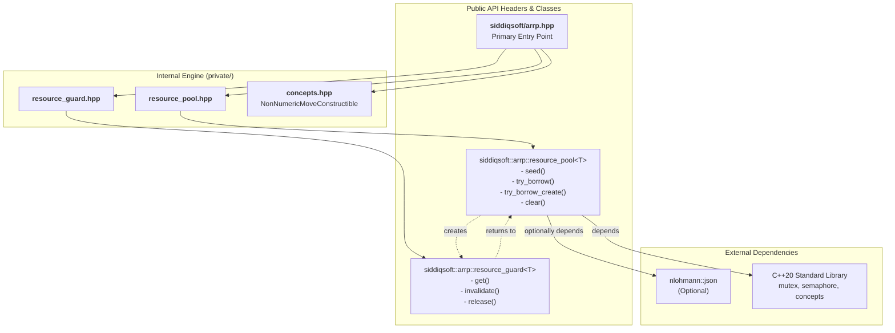

# About arrp

**arrp (Asynchronous Resource Reusable Pool)** is a lightweight, thread-safe, generic resource pool library for Modern C++20. It provides a robust, lock-aware, exception-safe mechanism to manage, limit, borrow, and loan expensive objects such as database connections, sockets, and heavy compute buffers.

<div class="grid" markdown="1">

<div class="card" markdown="1">
### Thread-Safe &amp; Lock-Aware
Leverages `std::mutex` and `std::counting_semaphore` for atomic visibility and efficient concurrency without data races.
</div>

<div class="card" markdown="1">
### Exception-Safe Guards
Implements `resource_guard<T>`, providing RAII-based lifecycle management to ensure borrowed resources are automatically returned to the pool, even if exceptions are thrown.
</div>

<div class="card" markdown="1">
### Zero-Copy Moves
Moves expensive resources directly in and out of the pool memory structures without triggering copy semantics, drastically reducing latency.
</div>

<div class="card" markdown="1">
### JSON Diagnostics
Optional built-in integration with `nlohmann::json` to instantly dump detailed operational pool statistics for production telemetry.
</div>

</div>

## Quick Facts

<div class="md-typeset__scrollwrap" markdown="1">
<table class="api-summary-table">
  <tbody>
    <tr>
      <td class="memitemleft" style="width:25%"><strong>Language Standard</strong></td>
      <td>C++20 (requires Concepts and Coroutines support)</td>
    </tr>
    <tr>
      <td class="memitemleft"><strong>Design Pattern</strong></td>
      <td>Generic Resource Pool / Object Pool</td>
    </tr>
    <tr>
      <td class="memitemleft"><strong>Integration</strong></td>
      <td>Header-only (<code>#include &lt;siddiqsoft/arrp.hpp&gt;</code>)</td>
    </tr>
    <tr>
      <td class="memitemleft"><strong>Core Dependency</strong></td>
      <td><code>nlohmann/json</code> (optional, for telemetry)</td>
    </tr>
  </tbody>
</table>
</div>

<div class="feature-span-all" markdown="1">

### Usage Examples

=== "Basic Resource Borrowing"

    ```cpp
    #include <iostream>
    #include <string>
    #include <siddiqsoft/arrp.hpp>

    int main() {
        // 1. Create a pool with a max capacity of 10 std::strings
        siddiqsoft::arrp::resource_pool<std::string> pool(10);
        
        // 2. Seed the pool with an object
        pool.seed("Pre-allocated Connection String");
        
        // 3. Borrow the object using RAII guard
        auto guard = pool.try_borrow();
        if (guard.is_valid()) {
            std::cout << "Borrowed: " << guard.get() << "\n";
            // Object is automatically returned to the pool when 'guard' goes out of scope
        }
    }
    ```

=== "Factory-Backed On-Demand Creation"

    ```cpp
    #include <iostream>
    #include <siddiqsoft/arrp.hpp>

    struct ExpensiveConnection {
        ExpensiveConnection() { std::cout << "Connected!\n"; }
    };

    int main() {
        siddiqsoft::arrp::resource_pool<ExpensiveConnection> pool(5);
        
        // Register a factory callback for on-demand resource creation
        pool.set_factory_callback([](auto& p) {
            return std::make_unique<ExpensiveConnection>();
        });
        
        // Since the pool is empty, try_borrow_create() automatically invokes the factory
        auto conn_guard = pool.try_borrow_create();
    }
    ```

=== "Validation & Abandonment"

    ```cpp
    #include <siddiqsoft/arrp.hpp>

    int main() {
        siddiqsoft::arrp::resource_pool<int> pool(5);
        pool.seed(42);
        
        {
            auto guard = pool.try_borrow();
            
            // Oh no, the resource is corrupted! Invalidate it so it is destroyed
            // and NOT returned to the pool upon guard destruction.
            guard.invalidate();
        }
    }
    ```

=== "Telemetry JSON Output"

    ```cpp
    #include <nlohmann/json.hpp>
    #include <siddiqsoft/arrp.hpp>
    #include <iostream>

    int main() {
        siddiqsoft::arrp::resource_pool<int> pool(10);
        pool.seed(1);
        pool.seed(2);
        
        auto borrowed = pool.try_borrow();
        
        // Generates diagnostic statistics if nlohmann/json is included FIRST
        auto stats = pool.to_json();
        std::cout << stats.dump(2) << "\n";
    }
    ```

</div>

## Architecture & Component Relationships

Relationship topology connecting public API entry points and domain models:



| Component | File Path | Class / Responsibility |
| :--- | :--- | :--- |
| **Resource Pool** | `include/siddiqsoft/private/resource_pool.hpp` | The `resource_pool<T>` handles tracking, counters, locking, and the core lifecycle queue. |
| **RAII Guard** | `include/siddiqsoft/private/resource_guard.hpp` | The `resource_guard<T>` borrows the underlying `T` and guarantees return-or-destroy on scope exit. |
| **Concepts constraints** | `include/siddiqsoft/private/concepts.hpp` | Ensures type `T` is valid for pooling (`NonNumericMoveConstructible`). |

## Documentation Sections

<div class="grid" markdown="1">

<div class="card" markdown="1">

### [Getting Started](quickstart/index.md)

Integration instructions for CMake FetchContent. Includes verified system requirements, compiler targets, and dependencies breakdown.

[Go to Getting Started :octicons-arrow-right-24:](quickstart/index.md)

</div>

<div class="card" markdown="1">

### [API Reference](api/index.md)

Complete Doxygen-derived API reference for `resource_pool` and `resource_guard`.

[Go to API Reference :octicons-arrow-right-24:](api/index.md)

</div>

<div class="card" markdown="1">

### [Related Pages](architecture/index.md)

Project architecture, maintainer guide, and technical details.

[Go to Related Pages :octicons-arrow-right-24:](architecture/index.md)

</div>

</div>
