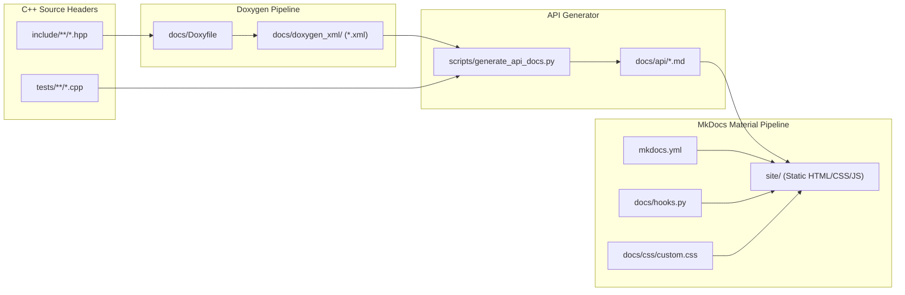

# Documentation Architecture & Customization Guide

Architecture, Doxygen XML extraction pipeline, design tokens, syntax highlighting, and local preview workflow.

---

## 1. Documentation Pipeline Architecture

The documentation system implements a standardized, accessible architecture powered by **Doxygen XML**, **MkDocs Material**, and a tokenized **CSS Design System**.



---

## 2. Building & Previewing Documentation Locally

Maintainers can preview and validate documentation changes locally before pushing:

### Live-Reload Development Server

```bash
# Activate Python environment and install requirements
source venv/bin/activate
pip install -r docs/requirements.txt

# Start live-reloading server
mkdocs serve
```

* **Local URL**: Open [`http://127.0.0.1:8000/`](http://127.0.0.1:8000/) in your browser.
* **Live Reload**: Any edits saved in `docs/` files update automatically in real time.

---

### Strict Build Validation

Verify there are zero broken links or markdown syntax issues:

```bash
mkdocs build --strict
```

The output compiles into `site/`. Open `site/index.html` directly in any browser.

---

## 3. Typography & Sizing Tokens

Primary typeface families are declared in [`mkdocs.yml`](https://github.com/SiddiqSoft/arrp/blob/master/mkdocs.yml) under `theme.font`. Material for MkDocs fetches these via Google Fonts:

```yaml
theme:
  font:
    text: Roboto         # Primary prose typeface
    code: JetBrains Mono # Monospace code & signature typeface
```

All typography dimensions, line heights, and element bindings are centralized at the top of [`docs/css/custom.css`](https://github.com/SiddiqSoft/arrp/blob/master/docs/css/custom.css).

---

## 4. Doxygen XML Pipeline Configuration

Doxygen is configured purely as an XML AST extractor via [`docs/Doxyfile`](https://github.com/SiddiqSoft/arrp/blob/master/docs/Doxyfile):

```ini
GENERATE_XML           = YES
XML_OUTPUT             = doxygen_xml
GENERATE_HTML          = NO
GENERATE_LATEX         = NO
EXTRACT_ALL            = YES
EXTRACT_STATIC         = YES
ENABLE_PREPROCESSING   = YES
MACRO_EXPANSION        = YES
BUILTIN_STL_SUPPORT    = YES
```

---

## 5. API Reference Generator & Parameter Folding Rules

[`scripts/generate_api_docs.py`](https://github.com/SiddiqSoft/arrp/blob/master/scripts/generate_api_docs.py) transforms Doxygen XML into terse, OpenCV-style markdown references:

1. **Member Function Boxes (`.memitem`)**:
   - Header strip with class diamond (`&#9670;`), method title, and badge (`static`, `static noexcept`).
   - Clean C++ prototype block (`.memproto`) with full namespace scoping.
   - Terse method description, parameter table, explicit return documentation, and authentic test snippets.

2. **Parameter Wrapping & Folding Rules**:
   - **Fold Just After `>`, Never Before**: Closing angle brackets (`>` / `>>`) always attach to the preceding token (e.g. `std::string_view)>>`).
   - **Type Modifiers Attached to Types**: Reference and pointer modifiers (`&`, `&&`, `*`) attach directly to their type name (`std::string_view&`, `const arrp&`).
   - **Break on Whitespace**: All folded lines cleanly break on whitespace following delimiters.
   - **Continuation Indentation**: Wrapped parameter names indent with standard continuation indent.

3. **UML Class Diagram & Source Links**:
   - Class hierarchies, method signatures, and exception taxonomies are dynamically derived from Doxygen XML AST.
   - Generates interactive Mermaid class diagrams with clickable links targeting the source header files on GitHub.
   - Automatically injected into [`docs/maintainers/maintainer_guide.md`](maintainer_guide.md), [`docs/architecture/index.md`](../architecture/index.md), and [`docs/api/index.md`](../api/index.md) on every build.

---

## 6. Dynamic Build Hooks (`docs/hooks.py`)

The MkDocs build lifecycle executes [`docs/hooks.py`](https://github.com/SiddiqSoft/arrp/blob/master/docs/hooks.py):

1. **`on_config`**:
   - Resolves SemVer version from `GITVERSION_SEMVER`, `CI_BUILDID`, `GitVersion.yml`, or `git describe`.
   - Executes `generate_dependencies_md.py` to document active CPM dependencies.
   - Executes `generate_api_docs.py` to regenerate API reference from Doxygen XML.
   - Injects the resolved version into `config['extra']['version']`.
2. **`on_page_markdown`**:
   - Dynamically replaces `{{ version }}` and `{{ tag_version }}` placeholders across all markdown pages at build time.

---

## Related Topics

* [**Maintainer Guide**](maintainer_guide.md): Core maintainer guide and bulk clang-formatting
* [**CI/CD Pipelines**](pipelines.md): Automated CI pipeline that builds and publishes docs
* [**Release & Publication**](releases.md): GitVersion and release publication flow
