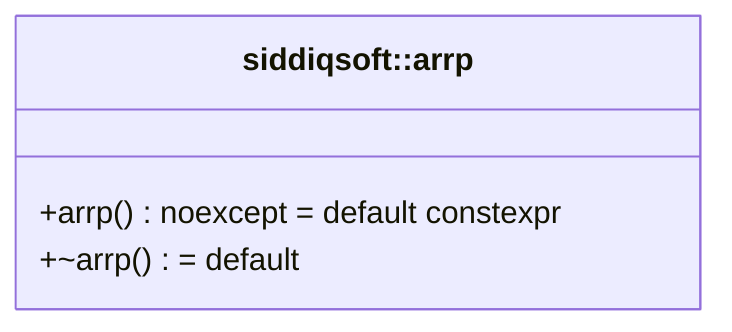

# Maintainer Guide

Codebase architecture, development guidelines, formatting standards, and maintainer documentation index for `siddiqsoft::arrp`.

---

## Documentation Index

The maintainer documentation is organized into modular topic guides:

| Topic Guide | Description |
| :--- | :--- |
| [**CI/CD Pipelines**](pipelines.md) | Azure Pipelines architecture, build matrix, platform triggers, and parameters |
| [**CMake Presets**](cmake_presets.md) | Decoupled presets hierarchy, `project-base.json`, and preset reference |
| [**Development Workflow**](workflow.md) | Local building, testing, and macOS toolchain management |
| [**Build Agent Requirements**](build_agents.md) | Prerequisites and configuration for macOS, Linux, and Windows self-hosted agents |
| [**Release & Publication**](releases.md) | GitVersion, SemVer tagging, GitHub Releases, and NuGet package publishing |
| [**Documentation Architecture**](documentation.md) | MkDocs Material, Doxygen XML, custom CSS tokens, hooks, and local preview |

---

## Codebase Architecture & UML Class Diagram

<!-- UML_CLASS_DIAGRAM_START -->
The following UML class diagram illustrates the primary classes, relationships, and inheritance in `arrp`. The diagram is auto-generated from the C++ source AST via Doxygen XML. Each node in the diagram links directly to its source header file on GitHub.



### Source Code Mapping

| Component / Class | Header File | Source Link | Purpose & Architectural Role |
| :--- | :--- | :--- | :--- |
| [`siddiqsoft::arrp`](../api/arrp.md) | <code><span class="filepath-dir">include/siddiqsoft/</span><wbr><span class="filepath-name">arrp.hpp</span></code> | [`arrp.hpp`](https://github.com/SiddiqSoft/arrp/blob/master/include/siddiqsoft/arrp.hpp#L26) | {{PROJECT_DESCRIPTION}} |
<!-- UML_CLASS_DIAGRAM_END -->

---

## Source Code Formatting (Clang-Format)

All C++ source code (`include/` and `tests/`) adheres to the formatting rules defined in [`.clang-format`](https://github.com/SiddiqSoft/arrp/blob/master/.clang-format) at the repository root.

The configuration is based on the **WebKit** style with modern C++20 conventions:
* **Column Limit**: 132 characters
* **Indentation**: 4 spaces (tabs are never used)
* **Brace Style**: WebKit (braces break before functions, classes, and catch/else blocks)
* **Pointer Alignment**: Left (`const arrp& item`, `std::string_view* ptr`)
* **Standard**: C++20

---

### How to Bulk Clang-Format the Source Code

Maintainers have multiple ways to format the entire codebase in bulk:

#### Option 1: Via CMake Build Target (Recommended)

When configured locally, CMake generates a dedicated `format` (and `clang-format`) target:

```bash
# Format using an active preset build directory:
cmake --build --preset Apple-Clang-Debug --target format

# Or format directly against any existing build folder:
cmake --build build/Apple-Clang-Debug --target format
```

> [!TIP]
> **Automatic Debug Formatting**: On non-CI local builds, CMake enables `arrp_ENABLE_CLANG_FORMAT=ON` by default in `Debug` configuration. Formatting runs automatically prior to every local Debug compilation whenever a compatible `clang-format` executable is detected.

---

#### Option 2: Bulk Command-Line via Find (macOS & Linux)

To reformat all C++ header and source files across `include/` and `tests/` in one command:

```bash
find include tests -type f \( -name "*.hpp" -o -name "*.cpp" -o -name "*.h" \) -exec clang-format -i --style=file {} +
```

To verify formatting without modifying files, pass `--dry-run --Werror`:

```bash
find include tests -type f \( -name "*.hpp" -o -name "*.cpp" -o -name "*.h" \) -exec clang-format --dry-run --Werror --style=file {} +
```

---

#### Option 3: Bulk Command-Line via Git (Cross-Platform)

Format all tracked C++ files in the repository using `git ls-files`:

=== "macOS & Linux (bash / zsh)"
    ```bash
    git ls-files '*.hpp' '*.cpp' '*.h' | xargs clang-format -i --style=file
    ```

=== "Windows (PowerShell)"
    ```powershell
    git ls-files '*.hpp', '*.cpp', '*.h' | ForEach-Object { clang-format -i --style=file $_ }
    ```

---

#### Option 4: Bulk PowerShell Script (Windows)

On Windows systems without Git bash, run the following PowerShell one-liner:

```powershell
Get-ChildItem -Path include, tests -Include *.hpp, *.cpp, *.h -Recurse | ForEach-Object {
    clang-format -i --style=file $_.FullName
}
```

---

#### Option 5: Editor & IDE Integration

* **Visual Studio 2022**: Visual Studio automatically detects `.clang-format` at the repository root. Press `Ctrl+K, Ctrl+D` to format the active document, or `Ctrl+K, Ctrl+F` to format a selection.
* **Visual Studio Code**: Ensure the [C/C++ Extension](https://marketplace.visualstudio.com/items?itemName=ms-vscode.cpptools) is installed. In `.vscode/settings.json`:
  ```json
  {
    "C_Cpp.clang_format_style": "file",
    "editor.formatOnSave": true
  }
  ```
* **CLion**: Navigate to **Settings > Editor > Code Style > C/C++** and verify **Enable ClangFormat** is checked. Press `Ctrl+Alt+L` (`Cmd+Alt+L` on macOS) to format.

---

## Maintainer Pre-Flight Checklist

Before submitting a pull request or pushing to `master`:

1. **Format Code**: Run the bulk clang-format command or `cmake --build <preset> --target format`.
2. **Build Cleanly**: Compile with zero compiler warnings using your platform preset:
   ```bash
   cmake --build --preset <preset-name>
   ```
3. **Execute All Tests**: Ensure 100% of tests pass:
   ```bash
   ctest --preset <preset-name> --output-on-failure
   ```
4. **Validate Documentation**: Verify zero broken links or markdown syntax errors:
   ```bash
   mkdocs build --strict
   ```
5. **Major Version Updates**: When introducing breaking API changes or preparing a major version release, manually update the `next-version:` entry in [`GitVersion.yml`](https://github.com/SiddiqSoft/arrp/blob/master/GitVersion.yml) (e.g. `next-version: 2.0.0`) so GitVersion establishes the new major version baseline.
