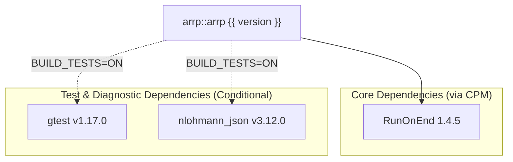

# Getting Started

`arrp` { version } is a header-only C++20 library for robust, exception-safe generic resource pools.
Add it via CPM, CMake `FetchContent`, or by copying the `include/` directory directly.

## System Requirements

| Category | Specification |
| :--- | :--- |
| **Language Standard** | C++20 (`/std:c++20` on MSVC; `-std=c++20` on Clang/GCC) |
| **Windows** | Microsoft Visual Studio 2022+ (MSVC v143+), architectures: `x64`, `arm64` |
| **macOS (Darwin)** | AppleClang (Xcode CommandLineTools / LLVM Clang), architecture: `arm64` |
| **Linux** | GCC 13+ or Clang 17+, architectures: `x64`, `arm64` |
| **Build Tools** | CMake 3.31+ with CMake Presets (v8) and Ninja |
| **Target Type** | `INTERFACE` (Header-only) |

## Dependencies

<!-- deps:start -->
The following table is auto-generated from `CMakeLists.txt` at build time.



| Dependency | Repository / Target | Version | Type | Scope |
| :--- | :--- | :--- | :--- | :--- |
| **RunOnEnd** | [`siddiqsoft/RunOnEnd`](https://github.com/siddiqsoft/RunOnEnd) | 1.4.5 | `CPM` | All Platforms (`INTERFACE`) |
| **gtest** | [`google/googletest`](https://github.com/google/googletest) | v1.17.0 | `CPM` | Tests only (`arrp_BUILD_TESTS=ON`) |
| **nlohmann_json** | [`nlohmann/json`](https://github.com/nlohmann/json) | v3.12.0 | `CPM` | Tests only (`arrp_BUILD_TESTS=ON`) |

<!-- deps:end -->

## Installation & Integration

=== "CPM.cmake (Recommended)"

    Add `arrp` to your `CMakeLists.txt` using [CPM.cmake](https://github.com/cpm-cmake/CPM.cmake):

    ```cmake
    include(cmake/CPM.cmake)

    CPMAddPackage("gh:SiddiqSoft/arrp#{ tag_version }")
    target_link_libraries(my_target PRIVATE arrp::arrp)
    ```

    **Build options** (pass via `-D` or `cmake-presets`):

    | Option | Default | Description |
    | :--- | :--- | :--- |
    | `arrp_BUILD_TESTS` | `OFF` | Build unit tests (requires GoogleTest). |

=== "CMake FetchContent"

    ```cmake
    include(FetchContent)

    FetchContent_Declare(
        arrp
        GIT_REPOSITORY https://github.com/SiddiqSoft/arrp.git
        GIT_TAG        { tag_version }
    )
    FetchContent_MakeAvailable(arrp)
    target_link_libraries(my_target PRIVATE arrp::arrp)
    ```

    **Build options** (pass via `-D` or `cmake-presets`):

    | Option | Default | Description |
    | :--- | :--- | :--- |
    | `arrp_BUILD_TESTS` | `OFF` | Build unit tests (requires GoogleTest). |

=== "Header-Only Include"

    Include the `include/` directory directly:

    ```cmake
    target_include_directories(my_target PRIVATE path/to/arrp/include)
    ```

## Basic Usage

Include `<siddiqsoft/arrp.hpp>`:

```cpp
#include <iostream>
#include <siddiqsoft/arrp.hpp>

int main() {
    siddiqsoft::arrp::resource_pool<int> pool(10);

    pool.seed(100);

    auto guard = pool.try_borrow();
    if (guard.is_valid()) {
        std::cout << "Borrowed: " << guard.get() << "\n";
    }

    return 0;
}
```

## Building and Running Tests Locally

The repository provides presets configured in `CMakePresets.json`:

=== "macOS (Darwin)"

    ```bash
    # Configure and build Release
    cmake --preset Apple-Clang-Release
    cmake --build --preset Apple-Clang-Release

    # Run unit tests
    ctest --preset Apple-Clang-Release
    ```

=== "Linux"

    ```bash
    # GCC toolchain
    cmake --preset Linux-GCC-Release
    cmake --build --preset Linux-GCC-Release
    ctest --preset Linux-GCC-Release
    ```

=== "Windows"

    ```powershell
    # Visual Studio 2022 (MSVC x64)
    cmake --preset x64-Release
    cmake --build --preset x64-Release
    ctest --preset x64-Release
    ```

## Related Topics

<div class="grid" markdown="1">

<div class="card" markdown="1">

### [API Reference](../api/index.md)

Detailed documentation for `siddiqsoft::arrp::resource_pool` and `siddiqsoft::arrp::resource_guard`.

[API Reference :octicons-arrow-right-24:](../api/index.md)

</div>

<div class="card" markdown="1">

### [Architecture](../architecture/index.md)

Design rationale and optimization notes.

[Architecture :octicons-arrow-right-24:](../architecture/index.md)

</div>

</div>
