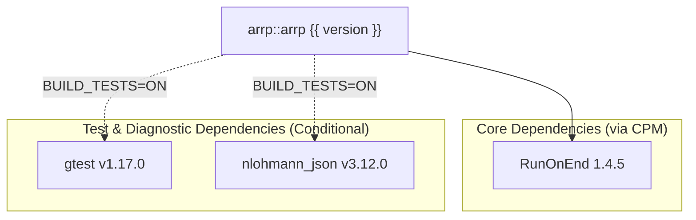

# Getting Started

Integration instructions for CMake FetchContent, CPM, and NuGet. `arrp` is header-only and trivially drops into C++20 toolchains.

---

## Installation & Integration

=== "CMake (CPM)"

    ```cmake
    CPMAddPackage(
        NAME arrp
        GITHUB_REPOSITORY SiddiqSoft/arrp
        GIT_TAG main
    )

    target_link_libraries(my_target PRIVATE arrp::arrp)
    ```

=== "CMake (FetchContent)"

    ```cmake
    include(FetchContent)

    FetchContent_Declare(
        arrp
        GIT_REPOSITORY https://github.com/SiddiqSoft/arrp.git
        GIT_TAG main
    )
    FetchContent_MakeAvailable(arrp)

    target_link_libraries(my_target PRIVATE arrp::arrp)
    ```

=== "NuGet"

    ```xml
    <PackageReference Include="SiddiqSoft.arrp" Version="0.0.0-dev" />
    ```

---

## Dependencies

<!-- deps:start -->
The following table is auto-generated from `CMakeLists.txt` at build time.



| Dependency | Repository / Target | Version | Type | Scope |
| :--- | :--- | :--- | :--- | :--- |
| **RunOnEnd** | [`siddiqsoft/RunOnEnd`](https://github.com/siddiqsoft/RunOnEnd) | 1.4.5 | `CPM` | All Platforms (`INTERFACE`) |
| **gtest** | [`google/googletest`](https://github.com/google/googletest) | v1.17.0 | `CPM` | Tests only (`arrp_BUILD_TESTS=ON`) |
| **nlohmann_json** | [`nlohmann/json`](https://github.com/nlohmann/json) | v3.12.0 | `CPM` | Tests only (`arrp_BUILD_TESTS=ON`) |

<!-- deps:end -->

---

## System Requirements

| Language / Standard | Compiler / Toolchain | Minimum Version |
| :--- | :--- | :--- |
| C++20 | GCC | 11.0+ |
| C++20 | Clang | 14.0+ |
| C++20 | MSVC | 2022+ |

---

## Usage Examples

=== "Scoped File Descriptor Pool"

    ```cpp
    #include <siddiqsoft/arrp.hpp>
    #include <cstdio>
    #include <iostream>

    int main() {
        siddiqsoft::arrp::resource_pool<FILE*> file_pool{
            2,
            [](FILE*& f) {
                if (f != nullptr) {
                    std::fclose(f);
                    f = nullptr;
                }
            }
        };

        file_pool.set_factory_callback([]() -> FILE* {
            return std::tmpfile();
        });

        auto file_guard = file_pool.try_borrow_create();
        if (file_guard && *file_guard) {
            std::fputs("arrp scoped file write", *file_guard);
            std::fflush(*file_guard);
        }

        return 0;
    }
    ```

=== "Custom Invalidation"

    ```cpp
    #include <siddiqsoft/arrp.hpp>
    #include <string>
    #include <iostream>

    int main() {
        siddiqsoft::arrp::resource_pool<std::string> pool{2};
        pool.seed("cached-string");

        auto guard = pool.try_borrow();
        if (guard) {
            if (guard->empty()) {
                guard.invalidate();
            } else {
                std::cout << "Valid string: " << *guard << "\n";
            }
        }
        return 0;
    }
    ```
