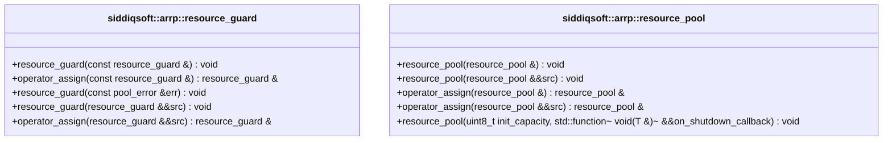

```mermaid
classDiagram
    direction TB

    classDef coreClass fill:rgba(35,73,109,0.08),stroke:#23496d,stroke-width:2px;
    classDef utilityClass fill:rgba(15,118,110,0.08),stroke:#0f766e,stroke-width:2px;
    classDef exceptionClass fill:rgba(185,28,28,0.06),stroke:#b91c1c,stroke-width:1.5px;
    classDef externalClass fill:rgba(100,116,139,0.06),stroke:#64748b,stroke-width:1.5px,stroke-dasharray: 4 3;
    classDef highlightClass fill:rgba(2,132,199,0.18),stroke:#0284c7,stroke-width:3px;

    class resource_guard["siddiqsoft::arrp::resource_guard"] {
        +resource_guard(const resource_guard &) void
        +operator_assign(const resource_guard &) resource_guard &
        +resource_guard(const pool_error &err) void
        +resource_guard(resource_guard &&src) void
        +operator_assign(resource_guard &&src) resource_guard &
    }
    class resource_guard:::coreClass

    class resource_pool["siddiqsoft::arrp::resource_pool"] {
        +resource_pool(resource_pool &) void
        +resource_pool(resource_pool &&src) void
        +operator_assign(resource_pool &) resource_pool &
        +operator_assign(resource_pool &&src) resource_pool &
        +resource_pool(uint8_t init_capacity, std::function~ void(T &)~ &&on_shutdown_callback) void
    }
    class resource_pool:::coreClass


    link resource_guard "https://github.com/SiddiqSoft/arrp/blob/master/include/siddiqsoft/private/resource_guard.hpp#L118" "Source: include/siddiqsoft/private/resource_guard.hpp"
    link resource_pool "https://github.com/SiddiqSoft/arrp/blob/master/include/siddiqsoft/private/resource_pool.hpp#L88" "Source: include/siddiqsoft/private/resource_pool.hpp"
```